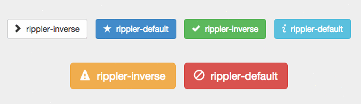

Rippler
==================
Effect that spreads like a wave in touch or click.  
You can also use the buttons on the bootstrap.  

##Example & Installation
http://blivesta.github.io/rippler

##License
MIT license.
